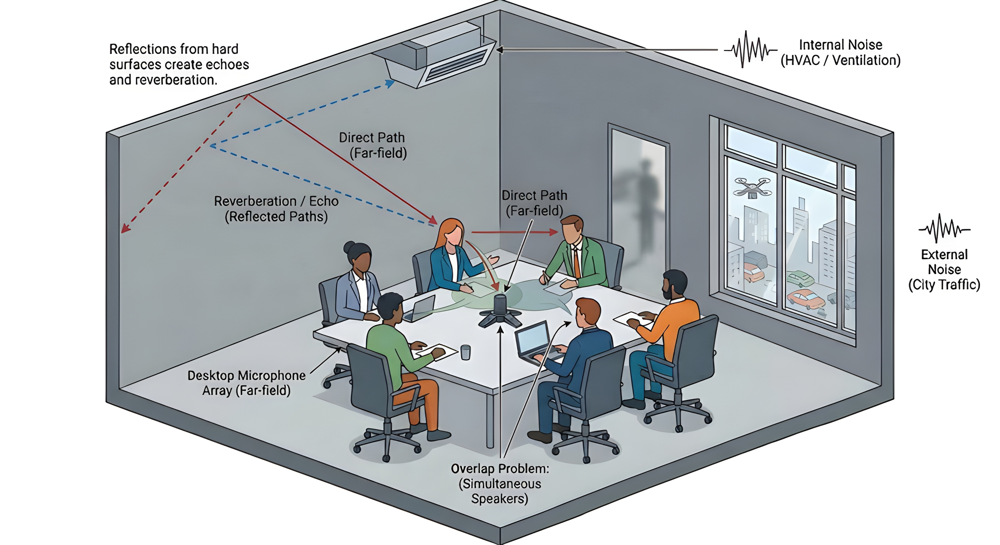
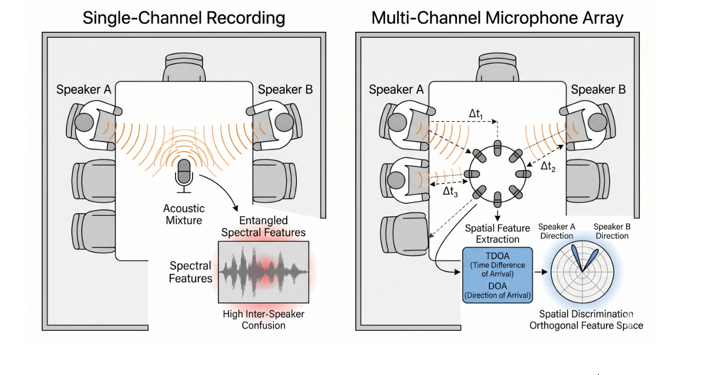

# AI-Assisted Scientific Illustration: A Personal Workflow and Perspective

In academic research, the ability to communicate ideas visually is just as important as writing equations or reporting experimental results. Whether we are explaining improvements to a system, presenting a technical challenge during a group meeting, or preparing figures for a conference paper, a well-designed illustration can often communicate complex ideas more effectively than paragraphs of text.

As AI tools continue to evolve, I have gradually started integrating models such as OpenAI GPT and Google Gemini into my own research workflow—not as replacements for manual design work, but as conceptual collaborators. Surprisingly, this approach has become one of the most practical additions to my research process.

This article is not meant to be a definitive guide or a technical tutorial. Instead, it is simply a reflection on a workflow that I personally find useful. I hope that sharing these experiences may offer a helpful perspective—or perhaps inspire alternative methods—for researchers who are exploring better ways to document and communicate their ideas.

---

## 1. Why Integrate AI into the Design Process?

Even though I still prefer creating the final publication figures manually—especially vector diagrams for papers, where precision and consistency are critical—AI tools are extremely valuable during the conceptual stage.

*   **Enhancing Understanding:** One of the biggest advantages of AI-assisted illustration is that it helps visualize abstract technical challenges. Complex ideas that may take several paragraphs to explain can sometimes become immediately understandable through a simple conceptual diagram. This is particularly useful when discussing research ideas with lab members, supervisors, or reviewers.
*   **Clarifying My Own Logic:** Interestingly, the process of writing prompts often helps me organize my own thinking. To generate a useful image, I need to explicitly define:
    *   Which components are important.
    *   What relationships exist between them.
    *   Which problem the figure is trying to emphasize.
    *   *In that sense, prompt writing becomes a form of technical reasoning rather than just image generation.*
*   **Finding Visual Inspiration:** Even if I eventually redraw everything manually, AI-generated drafts are excellent sources of inspiration. They often provide unexpected ideas for figure composition, information hierarchy, layout structure, color balance, and visual storytelling. Sometimes the generated image itself is unusable for publication, but the composition idea behind it is extremely valuable.

---

## 2. My Four-Step Workflow

When preparing diagrams for reports, presentations, or conference submissions, I generally follow a simple four-step workflow:

1.  **Define the Visualization Type:** Before touching any AI tool, I first clarify what kind of figure I actually need (e.g., conceptual pipeline, side-by-side comparison, architectural overview, or problem illustration). This saves a lot of unnecessary iteration later.
2.  **Draft the Initial Prompt:** I translate the mental image into descriptive language, focusing on technical clarity: what objects appear, the environment, important relationships, and what the viewer should notice first. I describe the scene as if explaining it to a colleague.
3.  **Refine the Prompt with AI:** I often ask AI systems to polish or restructure my draft prompt. The goal is not to make the prompt "fancier," but to make the visual intention more precise.
4.  **Iterative Generation:** Once the first draft is generated, I iterate conversationally (e.g., "Move the label higher," "Reduce visual clutter," "Use a cleaner academic color palette"). This feels similar to collaborating with a human designer during a brainstorming session.

---

### 3. Practical Example: Iterative Refinement of a Conceptual Diagram

To illustrate how this workflow works in practice, consider the design of a conceptual figure for meeting-room acoustic challenges in speaker diarization research. I did not reach the ideal result on the first try; rather, it was a process of iterative refinement through conversational feedback.

#### The Iterative Evolution
I started with a general request, then refined it through a series of "conversational edits" to make it more precise and less cluttered:

*   **Iteration 1 (Conceptualization):** I initially requested a 3D meeting room showing overlapping speech, a microphone array, and noise sources (HVAC/traffic). The output was useful, but it contained too many distracting lines and generic labels.
*   **Iteration 2 (Simplification):** I requested the removal of "complete floor" views and specific speaker labels (e.g., "Speaker 1") to keep the focus on the technical phenomena. I also asked to remove redundant dynamic elements and complex reverberation paths to improve visual clarity.
*   **Iteration 3 (Technical Focus):** Finally, I added specific technical annotations, such as a dedicated reflection diagram on the wall to illustrate the "Direct vs. Reverberant Path" and a clear "Internal Noise" label for the HVAC system.

#### The Final Prompt Strategy
After several rounds of refinement, the prompt became highly focused. It no longer just describes the "look" of the image; it dictates the specific technical narrative:

> **Finalized Prompt:**
> "Create a clean, minimalist 3D conceptual diagram of a modern meeting room.
> 
> *   **Overlap Problem:** Illustrate two speakers talking simultaneously; use a subtle shaded area labeled “Boundary Confusion.”
> *   **Internal Noise:** Include a ventilation vent on the upper ceiling corner labeled “Internal Noise (HVAC)” with a small, simple waveform icon.
> *   **Reverberation:** On the upper-left wall, include a dedicated, simple inset reflection diagram showing a “Direct Path” (solid line) and a “Reverberation Path” (dashed line), with the annotation: “Reflections from hard surfaces create echoes.”
> *   **Style:** Minimalist vector style, white background, limited academic color palette (gray, blue). Maintain a clean, professional layout suitable for an academic paper."

**Why This Matters:**

What I appreciate about this iterative approach is that the prompt becomes a vehicle for **clarifying my own technical narrative**. By deciding what to *remove* (like excessive lines) and what to *emphasize* (like the specific reflection paths), I forced myself to distill the research problem down to its most essential components. The AI helped me realize that in scientific illustration, **what you choose to leave out is often just as important as what you put in.**

**Final Output:**

---

## 4. Important Considerations for Researchers

*   **Resolution and Publication Quality:** AI-generated figures often look impressive at first glance, but publication standards are demanding. For conference papers, I usually treat AI output as a prototype rather than the final asset.
*   **Academic Integrity and Transparency:** Transparency matters. If an image—or even the base composition of a figure—is AI-generated, I believe it is good academic practice to disclose this appropriately in papers or presentations. Maintaining research integrity is more important than hiding the use of tools.
*   **Human Expertise Still Matters Most:** AI is best viewed as an assistant, not an author. The final responsibility for accuracy, clarity, and scientific communication still belongs to the researcher. In my own workflow, the final polishing stage is almost always manual.

---

### Closing Thoughts
I am still actively experimenting with this workflow myself, and my approach continues to evolve. What surprised me most was not the image quality itself, but how useful AI became during the thinking and planning stage of figure design. For me, AI-assisted illustration is less about replacing creativity and more about accelerating the path from abstract ideas to communicable visuals.

Sometimes we need the model to help us refine our initial prompt, generating images with a more detailed prompt.
**Another detailed example Prompt**

> `Create a clean scientific illustration comparing **Single-Channel Audio Capture** and **Multi-Channel Microphone Array Capture** in a meeting scenario.`
> 
> `The figure should be a **side-by-side comparison with two panels** and should look like a **professional diagram from a speech processing conference paper (ICASSP / Interspeech / IEEE)**.`
> 
> `Style requirements:`
> 
> `- Minimalist vector illustration`
> `- White background`
> `- Thin black outlines`
> `- Limited color palette (gray, blue, orange)`
> `- No cartoon style`
> `- Clean typography`
> `- Balanced layout suitable for academic publication`
> 
> `---`
> 
> `## LEFT PANEL — Single-Channel Scenario`
> 
> `Title at the top:`  
> `**Single-Channel Recording**`
> 
> `Scene layout:`
> 
> `1. Draw a **simple meeting room top-down view**.`
> `2. In the center of the table place **one omnidirectional microphone icon**.`
> `3. Place **two speakers** sitting at different positions around the table:`
> 
> `- Speaker A on the left`
> `- Speaker B on the right`
> 
> `Each speaker should have a small label near them:`
> 
> `**Speaker A**`  
> `**Speaker B**`
> 
> `4. Draw **acoustic wave lines** emitted from both speakers.`
> 
> `- The wavefronts propagate toward the center microphone.`
> `- The wave lines **overlap and merge near the microphone**.`
> 
> `5. Near the microphone, draw a small annotation:`
> 
> `**Acoustic Mixture**`
> 
> `6. From the microphone, draw an arrow pointing to the right toward a **waveform / spectrogram block**.`
> 
> `The block should show **two overlapping signals visually entangled**.`
> 
> `Add labels near the block:`
> 
> `**Entangled Spectral Features**`
> 
> `**High Inter-Speaker Confusion**`
> 
> `7. Use a subtle red highlight around the spectrogram to indicate **feature ambiguity**.`
> 
> `---`
> 
> `## RIGHT PANEL — Multi-Channel Scenario`
> 
> `Title at the top:`
> 
> `**Multi-Channel Microphone Array**`
> 
> `Scene layout:`
> 
> `8. Draw the **same meeting room layout** to keep the comparison consistent.`
> `9. Replace the single microphone with a **circular microphone array placed in the center**.`
> 
> `The array should consist of **6–8 small microphones arranged in a ring**.`
> 
> `10. Speakers A and B remain in the same positions as the left panel.`
> `11. Draw acoustic waves from both speakers reaching the microphones.`
> `12. Show that sound arrives at different microphones with **different delays**.`
> 
> `Indicate this by drawing **dashed distance lines** or **time-delay arrows** labeled:`
> 
> `**Δt₁**, **Δt₂**, **Δt₃**`
> 
> `13. From the microphone array draw arrows toward a **spatial processing block** labeled:`
> 
> `**Spatial Feature Extraction**`
> 
> `Inside the block include small labels:`
> 
> `**TDOA (Time Difference of Arrival)**`  
> `**DOA (Direction of Arrival)**`
> 
> `14. From this block draw an arrow to a **polar radar-style diagram** showing estimated sound directions.`
> 
> `The polar diagram should contain two peaks labeled:`
> 
> `**Speaker A Direction**`
> 
> `**Speaker B Direction**`
> 
> `15. Near the polar diagram place the annotation:`
> 
> `**Spatial Discrimination**`
> 
> `**Orthogonal Feature Space**`
> 
> `16. Use a subtle blue highlight around spatial features to indicate **clear separation**.`
> 
> `---`
> 
> `## COMPARISON DESIGN DETAILS`
> 
> `- Both panels must be aligned horizontally.`
> `- Speaker positions must be identical between panels.`
> `- Use the same table and room outline.`
> `- Only the microphone configuration changes.`
> 
> `Color coding:`
> 
> `- Gray → environment and waveform`
> `- Orange → acoustic waves`
> `- Blue → spatial processing`
> `- Red → ambiguous mixture`
> 
> `Typography:`
> 
> `- Clean sans-serif font`
> `- Minimal text`
> `- Academic figure style`
> 
> `Aspect ratio:`
> 
> `**16:9 wide layout**`
> 
> `Resolution:`
> 
> `**High resolution vector style suitable for publication**`

`Additional design constraints:`  
  
- `Maintain perfect visual symmetry between the two panels.`  
- `Use thin dashed lines to illustrate time differences.`  
- `Use transparent overlays for processing blocks.`  
- `Use minimal shading.`  
- `Avoid decorative elements.`  
- `Emphasize the conceptual difference between acoustic mixture and spatial separation.`

**Its results:**

